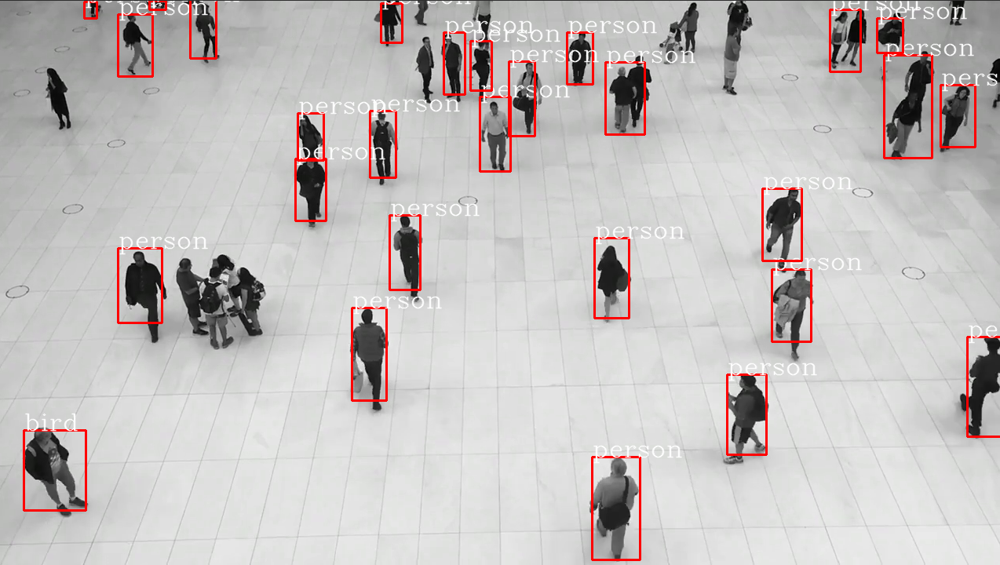

# yolov5-tflite-cpp
this project is an object detection app using tensorflow lite framework and yolov5 model.
first you need to convert the yolov5 model from torch to tensorflow lite using the tool that comes in the yolov5 default repo. 

#### yolov5 repo https://github.com/ultralytics/yolov5
```python
python export.py --include tflite --int --weights [path/to/torch/model] --data [path/to/model/data]
```
after converting the model.pt you will end up with model.tflite.


# Build 
opencv and tensorflow lite are needed.

the app got tested with opencv 4.5 and tensorflow lite 2.7


### tensorflow lite libs 
get the libs folder from https://github.com/muhammedakyuzlu/tensorflow_lite_libs_cpp.git


you need to change the direcktory in the CMakeLists.txt 18.line

then 
```bash
mkdir build && cd build \ 
cmake .. && make 
```
then you will have **yolov5-tfLite** executable file

# Example

./yolov5-tfLite [path/to/model] [path/to/classes/names] [path/to/the/video/input] [path/to/the/video/output]

```bash
./yolov5-tfLite ../models/model.tflite ../models/coco.names ../media/walkingPeople.mp4 ../media/out.avi 
```

the output should be like this
  
``` bash
Model loaded successfully.

Memory allocated for tensors.

Label Count: 80


Model run time 'milliseconds': 1096


Model run time 'milliseconds': 1116

.....
```

you will see the input video with boundring boxes around the 80 object that we trained the model over 


